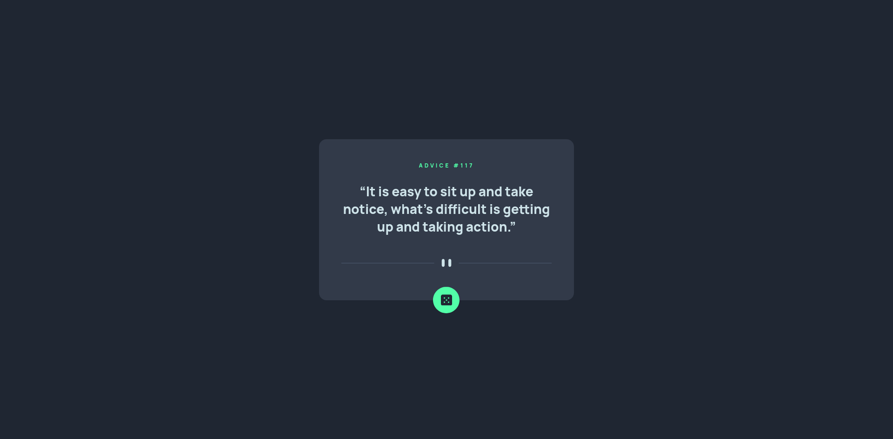

# Advice Generator App

This project was bootstrapped with [Create React App](https://github.com/facebook/create-react-app). This is a solution to the [Advice generator app challenge on Frontend Mentor](https://www.frontendmentor.io/challenges/advice-generator-app-QdUG-13db). Frontend Mentor challenges help you improve your coding skills by building realistic projects.

## Overview

### The challenge

Users should be able to:

- View the optimal layout for the app depending on their device's screen size
- See hover states for all interactive elements on the page
- Generate a new piece of advice by clicking the dice icon

### Screenshot




### Links

- Solution URL: https://github.com/kmalcaba/frontendmentor/tree/main/advice-generator-app
- Live Site URL: https://kmalcaba.github.io/frontendmentor/advice-generator-app/build/

## My process

### Built with

- React JS via Create React App
- CSS custom properties for colors
- Flexbox

### What I learned

This time around I wanted to use React to create the components and functionality. It might be a tad overkill for a very simple app but I just wanted to practice getting used to React.

I had difficulty working with svg files, and I had to google how to use them in React. For the dice button, I imported it as a React Component via:

```js
import { ReactComponent as DiceSvg } from "...";
```

But for the divider, I simply embedded it as a `background-image`, which I hadn't thought of at first, and is actually a way simpler solution than making it a React Component then doing other complicated stuff to make it responsive.

I also had a bit of trouble aligning the dice button, thinking I shouldn't be using things like `position: absolute` because I only wanted to rely on Flexbox for layout and positioning, but I looked at other solutions and figured I'd do the same.

I also learned I could create glow effects in CSS using `box-shadow`. I was familiar with `box-shadow` but only as a shadow for an element. Resource used is linked below.

### Useful resources

- [reactjs - How to display svg icons(.svg files) in UI using React Component? - Stack Overflow](https://stackoverflow.com/questions/42296499/how-to-display-svg-icons-svg-files-in-ui-using-react-component) - Here's where I got the bright idea to make the Dice svg as a React Component... though I'm not too sure if I'm violating any best practices by doing that lol

- [Creating Glow Effects with CSS / Coder's Block](https://codersblock.com/blog/creating-glow-effects-with-css/) - This helped me to create the glow effects for the button's hover and active states

## Available Scripts

In the project directory, you can run:

### `npm start`

Runs the app in the development mode.\
Open [http://localhost:3000](http://localhost:3000) to view it in your browser.

The page will reload when you make changes.\
You may also see any lint errors in the console.

### `npm test`

Launches the test runner in the interactive watch mode.\
See the section about [running tests](https://facebook.github.io/create-react-app/docs/running-tests) for more information.

### `npm run build`

Builds the app for production to the `build` folder.\
It correctly bundles React in production mode and optimizes the build for the best performance.

The build is minified and the filenames include the hashes.\
Your app is ready to be deployed!

See the section about [deployment](https://facebook.github.io/create-react-app/docs/deployment) for more information.

### Deployment

This section has moved here: [https://facebook.github.io/create-react-app/docs/deployment](https://facebook.github.io/create-react-app/docs/deployment)

## Author

- Frontend Mentor - [@kmalcaba](https://www.frontendmentor.io/profile/kmalcaba)

