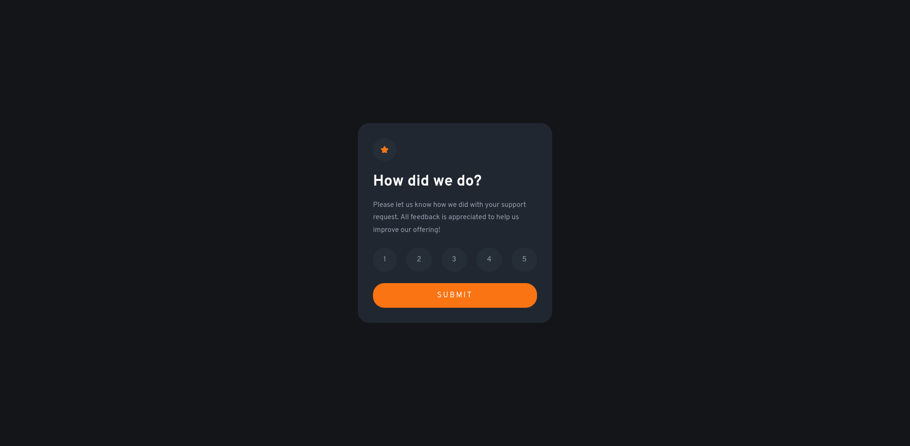

# Interactive rating component solution

This is a solution to the [Interactive rating component challenge on Frontend Mentor](https://www.frontendmentor.io/challenges/interactive-rating-component-koxpeBUmI).

## Table of Contents

- [Table of Contents](#table-of-contents)
- [Overview](#overview)
  - [The challenge](#the-challenge)
  - [Screenshot](#screenshot)
  - [Links](#links)
- [My Process](#my-process)
  - [Built with](#built-with)
  - [What I learned](#what-i-learned)
  - [Continued development](#continued-development)
  - [Useful resources](#useful-resources)
- [Author](#author)

## Overview

### The challenge

Users should be able to:

- View the optimal layout for the app depending on their device's screen size
- See hover states for all interactive elements on the page
- Select and submit a number rating
- See the "Thank you" card state after submitting a rating

### Screenshot

### Links

- Solution URL: https://github.com/kmalcaba/frontendmentor/tree/main/interactive-rating-component
- Live Site URL: https://kmalcaba.github.io/frontendmentor/interactive-rating-component/

## My Process

### Built with

- Flexbox
- Vanilla JavaScript

### What I learned

Flexbox really helped with styling the layout of this page. It was very easy to start out with the HTML containers, then the elements inside those containers, and making them flexboxes if I need them to be.

For example, the rating box is a column flexbox, but the rating numbers, contained within a `
` is a row flexbox.

For selecting the numbers, I added a class of `.active` to the selected element, then toggled other active elements if one was previously clicked. Upon submitting, the script looks for the active selected element, then gets that value via `textContent` and passes it into the next window.

### Continued development

There might be an easier/more efficient way to toggle the active elements, rather than looping through them and checking if it's active, then toggling it. But the solution I made was off the top of my head.

Also, I could have added a flipping animation on the card upon submission.

More things, from feedback on my solution: improving the submit button to be unclickable when no rating is selected, adding hover styling on the submit button, renaming some classes to make more sense, changing font sizes to em/rem instead of pixels. Shoutout to @ToFu96 for the feedback!

- As of 23/05/2022 - above feedback has been applied to main branch

### Useful resources

- [The Odin Project](https://www.theodinproject.com/) - Very useful course to teach you about the fundamentals of web development. I had prior knowledge of HTML, CSS, and JavaScript before this, but the course outline really helps to give you a structure of what you need to learn and projects to apply what you've learned. If not for TOP, I would not have learned Flexbox!

## Author

- Frontend Mentor - [@kmalcaba](https://www.frontendmentor.io/profile/kmalcaba)
